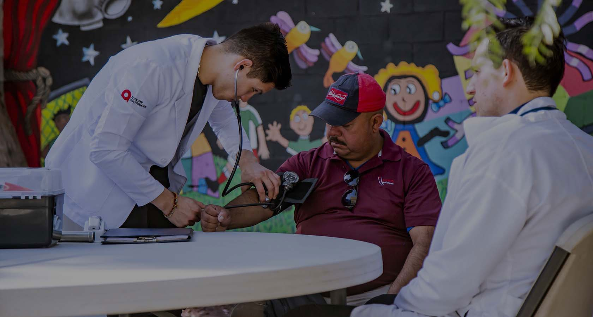

<div align="center">
  
  <h1>Blood Donor Management System (BBDMSS)</h1>
  <p>A modern, responsive web application for managing blood donors, requests, and blood bank operations.</p>
</div>

---

🌟 **Features**

- Responsive Design: Works perfectly on all devices (desktop, tablet, mobile)
- Modern UI/UX: Clean and professional interface with smooth navigation
- Donor Registration & Profile: Easy sign-up and profile management for donors
- Blood Request Workflow: Submit, track, and manage blood requests
- Admin Dashboard: Manage donors, requests, and blood groups
- Secure Authentication: Password management and secure login
- Contact & Support: Built-in contact form for queries

---

🛠️ **Technologies Used**

- PHP (Backend logic)
- MySQL (Database, not included in this repo)
- HTML5, CSS3, JavaScript (Frontend)
- Bootstrap (Responsive UI)

---

📁 **Project Structure**

```
bbdms/
├── admin/           # Admin dashboard and management tools
├── includes/        # Shared PHP includes (header, footer, config)
├── css/             # Stylesheets
├── js/              # JavaScript files
├── images/          # Image assets
├── webfonts/        # Font files
├── *.php            # Main PHP files for user-facing features
```

---

🚀 **Getting Started**

1. **Clone the repository:**
	```bash
	git clone https://github.com/manojmm22/blood-donar-managment-system.git
	```
2. **Import the database:**
	- Import the provided SQL file (if available) into your MySQL server.
	- Create necessary tables as per your requirements.
3. **Configure the database connection:**
	- Update `includes/config.php` with your MySQL credentials.
4. **Run the application:**
	- Place the project folder in your web server's root directory (e.g., `htdocs` for XAMPP).
	- Access via `http://localhost/bbdms` (or your configured path).

---

🎨 **Customization**

- **Colors & Styles:**
  - Edit CSS files in `css/` to change theme colors, fonts, and layout.
- **Content:**
  - Update PHP and HTML files to modify sections, add features, or change text.

---

📱 **Responsive Breakpoints**

- Desktop: > 992px
- Tablet: 768px - 992px
- Mobile: < 768px

---

🔧 **Browser Support**

- Chrome (latest)
- Firefox (latest)
- Safari (latest)
- Edge (latest)

---

## 👤 Author

**Manoj M**  
Web Developer & Python Programmer  
[GitHub](https://github.com/manojmm22) • [Email](mailto:manoj22m2003@gmail.com)

---

🙏 **Acknowledgments**

- Bootstrap for UI framework
- Font Awesome for icons
- Google Fonts for typography

---

## 📄 License
This project is for educational purposes.
